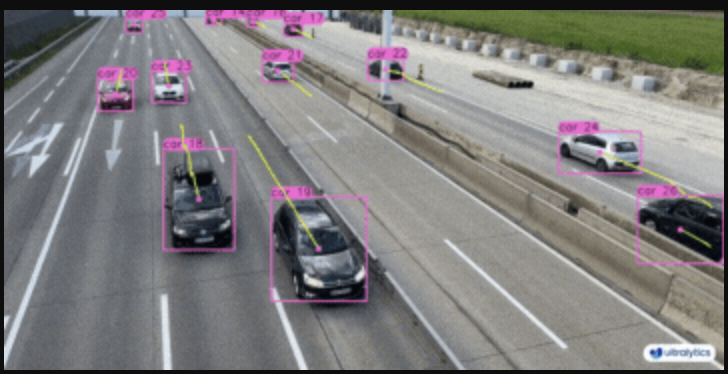

Experiment YOLO Tracking
------ 

Repository for experiment YOLO Detection, Tracking, World



# Installation

1. Setup Envrironment using conda

```bash
# Create conda env
conda create -n exp-yolo-tracking python=3.11 -y
conda activate exp-yolo-tracking
pip install -r requirements.txt
```

2. Setup Environment using ven

```bash
# Activate venv
python -m venv .venv
source .venv/bin/activate
pip install -r requirements.txt
```

# Experiments

## Object Tracking (Online)

Process video in real-time frame-by-frame, usually in streaming context.

```bash
make tracking_online
```

## Object Tracking (Offline)

Process video file, usually when we have saved video file. Because we have all the frames saved hence we can use batching to gain better performance (faster)

```bash
make tracking_offline
```

## Object Counting

Using `ultralytics.solutions.ObjectCounter` with model `yolo11x.pt` to count object. 

```bash
make counting_object
```

## YOLO World

YOLO-World tackles the challenges faced by traditional Open-Vocabulary detection models, which often rely on cumbersome Transformer models requiring extensive computational resources. These models' dependence on pre-defined object categories also restricts their utility in dynamic scenarios. YOLO-World revitalizes the YOLOv8 framework with open-vocabulary detection capabilities, employing vision-language modeling and pre-training on expansive datasets to excel at identifying a broad array of objects in zero-shot scenarios with unmatched efficiency.

**Key Features:**

- Real-time Solution: Harnessing the computational speed of CNNs, YOLO-World delivers a swift open-vocabulary detection solution, catering to industries in need of immediate results.

- Efficiency and Performance: YOLO-World slashes computational and resource requirements without sacrificing performance, offering a robust alternative to models like SAM but at a fraction of the computational cost, enabling real-time applications.

- Inference with Offline Vocabulary: YOLO-World introduces a "prompt-then-detect" strategy, employing an offline vocabulary to enhance efficiency further. This approach enables the use of custom prompts computed apriori, including captions or categories, to be encoded and stored as offline vocabulary embeddings, streamlining the detection process.

- Powered by YOLOv8: Built upon Ultralytics YOLOv8, YOLO-World leverages the latest advancements in real-time object detection to facilitate open-vocabulary detection with unparalleled accuracy and speed.

- Benchmark Excellence: YOLO-World outperforms existing open-vocabulary detectors, including MDETR and GLIP series, in terms of speed and efficiency on standard benchmarks, showcasing YOLOv8's superior capability on a single NVIDIA V100 GPU.

- Versatile Applications: YOLO-World's innovative approach unlocks new possibilities for a multitude of vision tasks, delivering speed improvements by orders of magnitude over existing methods.


```bash
make yolo-world
```